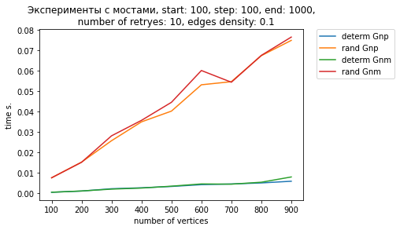
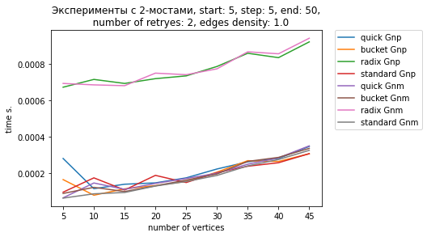

```python
import numpy as np
import networkx as nx
from collections import defaultdict
import time
import ctypes as C
import ast

%matplotlib notebook
import matplotlib.pyplot as plt
%pylab inline
```

    Populating the interactive namespace from numpy and matplotlib
    

## Генераторы графов


```python
# функция возвращает случайный простой граф в моделе Gnp 
# вероятность ребра p = 2*m/(n*(n-1)), чтобы среденее число ребер было = m
# структура хранения - список смежности, реализованный через словарь (хеш-таблица) списков 
# ребра представляют собой tuple двух вершин
def get_random_simple_Gnp_graph(n, m, seed=42):
  edge_p = 2*m/(n*(n-1))
  g = nx.random_graphs.fast_gnp_random_graph(n,edge_p,seed)
  
  return nx.convert.to_dict_of_lists(g)
```


```python
# функция возвращает случайный ориентированный граф в моделе Gnp 
# вероятность ребра p = m/(n*(n-1)), чтобы среденее число ребер было = m
# структура хранения - список смежности, реализованный через словарь (хеш-таблица) списков 
# ребра представляют собой tuple двух вершин
def get_random_Gnp_digraph(n, m, seed=42):
  edge_p = m/(n*(n-1))
  g = nx.random_graphs.fast_gnp_random_graph(n,edge_p,seed,True)
  
  return nx.convert.to_dict_of_lists(g)
```


```python
# функция возвращает случайный простой граф в моделе Gnm 
# структура хранения - список смежности, реализованный через словарь (хеш-таблица) списков 
# ребра представляют собой tuple двух вершин
def get_random_simple_Gnm_graph(n, m, seed=42):
  g = nx.random_graphs.gnm_random_graph(n,m,seed)

  return nx.convert.to_dict_of_lists(g)
```


```python
# функция возвращает случайный ориентированный граф в моделе Gnm
# структура хранения - список смежности, реализованный через словарь (хеш-таблица) списков 
# ребра представляют собой tuple двух вершин
def get_random_Gnm_digraph(n, m, seed=42):
  g = nx.random_graphs.gnm_random_graph(n,m,seed,True)

  return nx.convert.to_dict_of_lists(g)
```


```python
# функция возвращает связный ориентированный Ейлеров граф
# в графе n вершин, k - параметр, от которого зависти генерация
# структура хранения - список смежности, реализованный через словарь (хеш-таблица) списков 
# ребра представляют собой tuple двух вершин
def get_Euler_digraph(n, k=8):
  in_degs, out_degs = [k]*n, [k]*n 
  G = nx.generators.directed_havel_hakimi_graph(in_degs, out_degs)
  WCCs = list(nx.algorithms.components.weakly_connected_components(G))
  if len(WCCs) > 1:
    connecting_nodes = []
    for WCC in WCCs:
      some_vertex_of_WCC = next(iter(WCC))
      connecting_nodes.append(some_vertex_of_WCC)
    for i in range(1, len(connecting_nodes)):
      G.add_edge(connecting_nodes[i-1],connecting_nodes[i])
      G.add_edge(connecting_nodes[i],connecting_nodes[i-1])
    
  return nx.convert.to_dict_of_lists(G)
```


```python
# утилитарная функция, переводящая таплы вида (1, 0, 0, 1)
# в числа, интерпетируя эту запись как число в двоичной записи
# эта функция нужна для следующей функции
def get_index_from_binary(tup):
  n = len(tup)
  mult = 1
  res = 0
  for i in range(n):
    res += tup[i]*mult
    mult *= 2
  return res

# функция возвращает связный ориентированный регулярный Ейлеров граф
# входные и выходные степени всех вершин совпадают и равны half_dim
# число вершин равно 4**half_dim
# структура хранения - список смежности, реализованный через словарь (хеш-таблица) списков 
# ребра представляют собой tuple двух вершин
def get_hypercube_digraph(half_dim):
  G = nx.generators.hypercube_graph(half_dim*2)
  directed_G = nx.DiGraph()
  Euler_circuit_G = nx.algorithms.eulerian_circuit(G)
  for (u,v) in Euler_circuit_G:
    directed_G.add_edge(get_index_from_binary(u), get_index_from_binary(v))
  return nx.convert.to_dict_of_lists(directed_G)
```

# Алгоритмы сортировки


```python
bucket = C.CDLL('./src/BucketSort/BucketSort.so')
bucket.bucket_sort.restype = C.POINTER(C.c_uint64)
bucket.bucket_sort.argtypes = [C.POINTER(C.c_uint64), C.c_uint64, ]

radix = C.CDLL('./src/RadixSort/RadixSort.so')
radix.radix_sort.restype = C.POINTER(C.c_uint64)
radix.radix_sort.argtypes = [C.POINTER(C.c_uint64), C.c_uint64, ]

quick = C.CDLL('./src/QuickSort/QuickSort.so')
quick.c_quick_sort.restype = C.POINTER(C.c_uint64)
quick.c_quick_sort.argtypes = [C.POINTER(C.c_uint64), C.c_uint64, ]
```


```python
# поразрядная сортировка
# возвращает итоговую перестановку эелементов массива A
# для того, чтобы можно было переставить элементы в любом другом массиве
def radix_argsort(A):
    arr = (C.c_uint64 * len(A))(*A)
    res = radix.radix_sort(C.cast(C.byref(arr), C.POINTER(C.c_uint64)), len(A))
    return [res[i] for i in range(len(A))]
```


```python
# карманная сортировка
# возвращает итоговую перестановку эелементов массива A
# для того, чтобы можно было переставить элементы в любом другом массиве
def bucket_argsort(A):
    arr = (C.c_uint64 * len(A))(*A)
    res = bucket.bucket_sort(C.cast(C.byref(arr), C.POINTER(C.c_uint64)), len(A))
    return [res[i] for i in range(len(A))]
```


```python
# быстрая сортировка
# возвращает итоговую перестановку эелементов массива A
# для того, чтобы можно было переставить элементы в любом другом массиве
def quick_argsort(A):
    arr = (C.c_uint64 * len(A))(*A)
    res = quick.c_quick_sort(C.cast(C.byref(arr), C.POINTER(C.c_uint64)), len(A))
    return [res[i] for i in range(len(A))]
```

# Алгоритмы для поиска мостов


```python
def adj_list_to_byte(adj_list):
    adj_list_string = ''
    for vertex in adj_list:
        adj_list_string+='('
        count=0
        for adjacent in adj_list[vertex]:
            adj_list_string+=str(adjacent)+','
            count+=1
        if count > 0:
            adj_list_string=adj_list_string[:-1]
        adj_list_string+=')'
    print(adj_list_string)
    return adj_list_string.encode('utf-8')
```

**Мосты на C/C++ начали крашиться при вызове из DLL. С идентичными входными данными работали нормально, если запускать из экзешника. Не осталось времени разобраться в чем дело, просто переписал на Питоне.**


```python
bridge = C.CDLL('./so/Bridges.so')

bridge.compute_bridges_determ.restype = C.c_char_p
bridge.compute_bridges_determ.argtypes = [C.c_char_p, C.c_uint64, ]

bridge.compute_bridges_rand.restype = C.c_char_p
bridge.compute_bridges_rand.argtypes = [C.c_char_p, C.c_uint64, ]

bridge.compute_2bridges_rand.restype = C.c_char_p
bridge.compute_2bridges_rand.argtypes = [C.c_char_p, C.c_uint64, C.c_int]
```


```python
# детерминированный алгоритм для поиска мостов
# на вход поступает граф представленный списком смежности
# саписок представлен как словарь(хеш-таблица) списков
# выход представляет собой список ребер, являющихся мостами 
#def compute_bridges_determ(adj_list):
#    adj_list_char_str = adj_list_to_byte(adj_list)
#    result = bridge.compute_bridges_determ(adj_list_char_str, len(adj_list_char_str))
#    return result.decode('utf-8')

class DetermBridges:
    def __init__(self):
        self.timer = 0
        self.history = []
        self.bridges = []
        self.colors = []
        self.M = []
        self.entry = []
        self.adj_list = {}
    
    def bridges_determ_dfs(self, vertex):
        self.colors[vertex] = 'gray'
        self.history.append(vertex)
        self.timer += 1
        self.entry[vertex] = self.timer
        for adjacent in self.adj_list[vertex]:
            if (self.colors[adjacent] == 'white'):
                self.bridges_determ_dfs(adjacent)
                self.M[vertex] = min(self.M[vertex], self.M[adjacent])
                if (self.M[adjacent] > self.entry[vertex]):
                    if (vertex < adjacent):
                        self.bridges.append((vertex, adjacent))
                    else:
                        self.bridges.append((adjacent, vertex))
            elif len(self.history) < 2 or self.history[-2] != adjacent:
                self.M[vertex] = min(self.M[vertex], self.entry[adjacent])
        self.colors[vertex] = 'black'
        self.history.pop()

    def determ_bridges(self, adj_list):
        self.timer = 0
        self.history = []
        self.bridges = []
        self.colors = ['white' for i in adj_list]
        self.M = [float('inf') for i in adj_list]
        self.entry = [0 for i in adj_list]
        self.adj_list = adj_list
        for i in adj_list:
            if self.colors[i] == 'white':
                self.bridges_determ_dfs(i)
        return self.bridges
    
def compute_bridges_determ(adj_list):
    determ = DetermBridges()
    return determ.determ_bridges(adj_list)
```


```python
import numpy as np
import random as rd

class RandomBridges:

    def __init__(self):
        self.adj_list = {}
        self.bridges = []
        self.edges = []
        self.colors = []
        self.history = []
        self.samples = {}
        self.EDGE = 0
        self.SAMPLE = 1

    def sampling_dfs(self, vertex):
        self.colors[vertex] = 'gray'
        self.history.append(vertex)
        for adjacent in self.adj_list[vertex]:
            if self.colors[adjacent] == 'white':
                self.sampling_dfs(adjacent)
            elif len(self.history) < 2 or self.history[-2] != adjacent:
                rand = np.uint64(rd.randint(0, np.iinfo(np.uint64).max))
                self.samples[vertex][adjacent] = rand;
                self.samples[adjacent][vertex] = rand;
        self.colors[vertex] = 'black';
        self.history.pop()

        if len(self.history) > 0:
            parent = self.history[-1]
            parent_edge_weight = np.uint64(0)
            for adjacent in self.adj_list[vertex]:
                if (adjacent != parent):
                    parent_edge_weight ^= self.samples[vertex][adjacent]
            self.samples[vertex][parent] = parent_edge_weight
            self.samples[parent][vertex] = parent_edge_weight
        
        
    def launch_sampling(self):
        self.colors = ['white' for i in self.adj_list]
        for vertex in self.adj_list:
            if self.colors[vertex] == 'white':
                self.sampling_dfs(vertex)
        
    def find_bridges(self, adj_list):
        self.adj_list = adj_list
        for i in range(len(adj_list)):
            self.samples[i] = {}
        self.launch_sampling()
        for first_key in self.adj_list:
            for second_key in self.adj_list[first_key]:
                if (second_key, first_key) not in self.bridges and self.samples[first_key][second_key] == 0:
                    self.bridges.append((first_key, second_key))
        return self.bridges
    
    def find_2bridges(self, adj_list, sort_fun):
        self.adj_list = adj_list
        for i in range(len(adj_list)):
            self.samples[i] = {}
        self.launch_sampling()
        for first_key in self.adj_list:
            for second_key in self.adj_list[first_key]:
                if (second_key, first_key) not in [edge[self.EDGE] for edge in self.edges]:
                    self.edges.append([(first_key, second_key), self.samples[first_key][second_key]])
        samples_list = [edge[self.SAMPLE] for edge in self.edges]
        sorted_args = sort_fun(samples_list)
        cluster_size = 0
        current_cluster = 0
        for i in range(len(sorted_args) - 1):
            cluster_size+=1
            if self.edges[sorted_args[i]][self.SAMPLE] != self.edges[sorted_args[i+1]][self.SAMPLE]:
                if (cluster_size > 1):
                    self.bridges.append([])
                    j = i - cluster_size + 1
                    while (j < i):
                        self.bridges[current_cluster].append((self.edges[sorted_args[j]][self.EDGE]))
                        j+=1
                    cluster_size = 0
                    current_cluster+=1
        return self.bridges
```


```python
# рандомизированный алгоритм для поиска мостов
# на вход поступает граф представленный списком смежности
# саписок представлен как словарь(хеш-таблица) списков 
# выход представляет собой список ребер, являющихся мостами с большой вероятностью
def compute_bridges_rand(adj_list):
    rand = RandomBridges()
    return rand.find_bridges(adj_list)
```


```python
# рандомизированный алгоритм для поиска 2-мостов
#
# на вход поступает граф представленный списком смежности и алгоритм сортировки для меток на ребрах
# саписок представлен как словарь(хеш-таблица) списков 
#
# выходом алгоритма является список списков ребер
# в каждом списке любая пара ребер должна с высокой вероятностью образовывать 2-мост
# например, если выходом является спискок [[e1, e2, e3],[e4, e5]]
# то с высокой вероятностью 2-мостами будут пары ребер: (e1,e2), (e1,e3), (e2,e3), (e4,e5)
# ребра здесь это пары вершин типа e1 = (1,2)
def compute_2bridges_rand(adj_list, sort_fun):
    rand = RandomBridges()
    return rand.find_2bridges(adj_list, sort_fun)
```

# Эйлеровы циклы


```python
def DFS_recursive(graph, S, colors, black_order):
    colors[S] = 'g'
    
    for adjacent in graph[S]:
        if (colors[adjacent] == 'w'):
            DFS_recursive(graph, adjacent, colors, black_order)
            
    colors[S] = 'b'
    black_order.append(S)
    
    
def DFS_wrapper(graph):
    colors = []
    black_order = []
    
    for i in range(len(graph)):
        colors.append('w')
    DFS_recursive(graph, next(iter(graph)), colors, black_order)
    return black_order
    
    
def convert_to_edge_graph(graph):
    edges_list = []
    
    for vertex in graph:
        for adjacent in graph[vertex]:
            edges_list.append((vertex, adjacent))
            
    edge_graph = {}
    
    for edge in range(len(edges_list)):
        edge_graph[edge] = []
        for potential_adjacent in range(len(edges_list)):
            if edges_list[edge][1] == edges_list[potential_adjacent][0]:
                edge_graph[edge].append(potential_adjacent)
                
    return edges_list, edge_graph
# функция вычисляющая эйлеров обход для данного ориентированного графа G 
# цикл кодируется списком ребер, например:
# (1,2), (2,4), (4, 7), (7,1)
#
def compute_Euler_circuit_digraph(adj_list):
  # тут должен быть Ваш код
  #G = nx.DiGraph(adj_list)
  #return list(nx.algorithms.eulerian_circuit(G))
    graph = adj_list
    edges_list, edge_graph = convert_to_edge_graph(graph)
    cycle = []
    for edge_index in DFS_wrapper(edge_graph):
        cycle.insert(0, edges_list[edge_index])
    return cycle

# функция вычисляющая эйлеров обход для данного простого графа G 
# цикл кодируется списком ребер, например:
# (1,2), (2,4), (4, 7), (7,1)
#
#def compute_Euler_circuit_simple(adj_list):
#  # тут должен быть Ваш код
#  G = nx.Graph(adj_list)
#  return list(nx.algorithms.eulerian_circuit(G))
```

# Арифметика в конечных кольцах и полях


```python
invert = C.CDLL('./so/Invert.so')

invert.invert_in_Zp_Euclead.restype = C.c_uint64
invert.invert_in_Zp_Euclead.argtypes = [C.c_uint64, C.c_uint64, ]

invert.invert_in_Zp_Ferma.restype = C.c_uint64
invert.invert_in_Zp_Ferma.argtypes = [C.c_uint64, C.c_uint64, ]
```


```python
# эта функция инвертирует x в Zp с помощью алгоритма Евклида
# выходом является целое число y, такое что
# 1) 0 < y < p 
# 2) (xy) mod p = 1 
# если число невозможно инвертировать, функция возвращает 0
def invert_in_Zp_Euclead(p,x):
    return invert.invert_in_Zp_Euclead(p, x)
```


```python
# эта функция инвертирует x в Zp с помощью малой теоремы Ферма и алгоритма быстрого возведения в степень
# выходом является целое число y, такое что
# 1) 0 < y < p 
# 2) (xy) mod p = 1 
# если число невозможно инвертировать, функция возвращает 0
def invert_in_Zp_Ferma(p,x):
    return invert.invert_in_Zp_Ferma(p, x)
```

# Стресс тесты


```python
def stress_test_bridges_determ(n, m, iterations_num=1000):
  for i in range(iterations_num):
    G = get_random_simple_Gnp_graph(n, m, i)
    briges_test = compute_bridges_determ(G)
    bridges_true = set(nx.algorithms.bridges(nx.Graph(G)))
    diff = list(bridges_true.symmetric_difference(briges_test))
    if len(diff) > 0:
      raise Exception(f"Неверное решение в детерминированном алгоритме поиска мостов, n: {n}, m: {m}, seed: {i}")
  print(f"Стресс тест для детерминированного поиска мостов пройден!, n: {n}, m: {m}, iterations_num: {iterations_num}")
    
```


```python
def stress_test_bridges_rand(n, m, iterations_num=1000):
  exp_err = m * (1/ (2**64))
  for i in range(iterations_num):
    G = get_random_simple_Gnp_graph(n, m, i)
    briges_test = compute_bridges_determ(G)
    bridges_true = set(nx.algorithms.bridges(nx.Graph(G)))
    diff = list(bridges_true.symmetric_difference(briges_test))
    if len(diff) > exp_err:
      raise Exception(f"Число ошибок в рандомизированном алгоритме поиска мостов превышено, n: {n}, m: {m}, errors_num: {len(diff)}, seed: {i}")
  print(f"Стресс тест для рандомизированного поиска мостов пройден!, n: {n}, m: {m}, iterations_num: {iterations_num}")
    
```


```python
def stress_test_finite_fields(p = 2**61-1, iterations_num = 100000):
  for i in range(iterations_num):
    x = numpy.random.randint(1, p)
    inverse_Euclead_x = invert_in_Zp_Euclead(p,x)
    inverse_Ferma_x = invert_in_Zp_Ferma(p,x)
    if( np.gcd(p,x) == 1 ):
      if (x * inverse_Euclead_x - 1) % p != 0:
        raise Exception(f"Неправильное инвертирование алгоритмом Евклида, p: {p}, x: {x}")
      if (x * inverse_Ferma_x - 1) % p != 0:
        raise Exception(f"Неправильное инвертирование алгоритмом быстрого возведения в степень, p: {p}, x: {x}")
    else :
      if inverse_Euclead_x != 0:
        raise Exception(f"Неправильное инвертирование алгоритмом Евклида, p: {p}, x: {x}")
      if inverse_Ferma_x != 0:
        raise Exception(f"Неправильное инвертирование алгоритмом быстрого возведения в степень, p: {p}, x: {x}")  
  print(f"Стресс тест для арифметики в конечных полях пройден!, p: {p}, iterations_num: {iterations_num}")
```


```python
def stress_test_2bridges_rand(n, m, sort, iterations_num=1000):
  exp_err = (m*(m-1)/2) * (1/ (2**64))
  for iteration in range(iterations_num):
    err_num = 0
    G = nx.Graph(get_random_simple_Gnp_graph(n, m, iteration))
    bridges_test = compute_2bridges_rand(G,sort)
    for edge_group in bridges_test:
      for e1 in range(len(edge_group)):
        for e2 in range(e1+1,len(edge_group)):
          G_with_deleted_2bridge = G.copy()
          G_with_deleted_2bridge.remove_edge(*edge_group[e1])
          G_with_deleted_2bridge.remove_edge(*edge_group[e2])
          if nx.connected.number_connected_components(G) == nx.connected.number_connected_components(G_with_deleted_2bridge):
            ++err_num
    if err_num > exp_err:
      raise Exception(f"Число ошибок в рандомизированном алгоритме поиска мостов превышено, n: {n}, m: {m}, errors_num: {err_num}, sort: {sort}, seed: {iteration}")
  print(f"Стресс тест для рандомизированного поиска мостов пройден!, n: {n}, m: {m}, , sort: {sort}, iterations_num: {iterations_num}")
```


```python
def test_Euler_circuit(G, test_circuit):
  edges_dict = {}
  m = 0
  for (v,neib) in G.items():
    for u in neib:
      edges_dict[(v,u)] = False
      m += 1

  l = len(test_circuit)
  if m != l:
    return False

  for i in range(1,m):
    if test_circuit[i-1][1] != test_circuit[i][0]:
      return False
  if test_circuit[l-1][1] != test_circuit[0][0]:
    return False

  for e in test_circuit:
    if edges_dict.get(e, True) == True:
      return False
    else:
      edges_dict[e] = True
    
  return True

# max_n должно быть строго больше чем 10
def stress_test_Euler_circuit_digraph(max_n, iterations_num=1000):
  for iteration in range(iterations_num):
    n = np.random.randint(10, max_n)
    k = np.floor(n/4)
    G = get_Euler_digraph(n,k)
    test_circuit = compute_Euler_circuit_digraph(G)
    if not test_Euler_circuit(G, test_circuit):
      raise Exception(f"Неправильный Эйлеров обход, функция генерации: get_Euler_digraph, n: {n}, k: {k}")
  print(f"Стресс тест для ориентированных Эйлеровых циклов пройден, max_n: {max_n}, iterations_num: {iterations_num}")
```

**Пришлось увеличить лимит рекурсии чтобы проходило хотя бы на 200 вершинах.**


```python
import sys
sys.setrecursionlimit(10000)
```


```python
stress_test_bridges_determ(100,30,100)
stress_test_bridges_rand(100,30,100)
stress_test_finite_fields(2347, 1000)
stress_test_2bridges_rand(100,30,radix_argsort,10)
stress_test_2bridges_rand(100,30,bucket_argsort,10)
stress_test_2bridges_rand(100,30,quick_argsort,10)
#stress_test_Euler_circuit_digraph(1000, 20)
stress_test_Euler_circuit_digraph(200, 20)
```

    Стресс тест для детерминированного поиска мостов пройден!, n: 100, m: 30, iterations_num: 100
    Стресс тест для рандомизированного поиска мостов пройден!, n: 100, m: 30, iterations_num: 100
    Стресс тест для арифметики в конечных полях пройден!, p: 2347, iterations_num: 1000
    Стресс тест для рандомизированного поиска мостов пройден!, n: 100, m: 30, , sort: <function radix_argsort at 0x7f4bdb7dd5e0>, iterations_num: 10
    Стресс тест для рандомизированного поиска мостов пройден!, n: 100, m: 30, , sort: <function bucket_argsort at 0x7f4bdb51e040>, iterations_num: 10
    Стресс тест для рандомизированного поиска мостов пройден!, n: 100, m: 30, , sort: <function quick_argsort at 0x7f4bdb51e280>, iterations_num: 10
    Стресс тест для ориентированных Эйлеровых циклов пройден, max_n: 200, iterations_num: 20
    

# Юнит тесты


```python
def finite_fields_unit_tests():
  assert(invert_in_Zp_Euclead(6,4) == 0)
  assert(invert_in_Zp_Ferma(6,4) == 0)

  assert(invert_in_Zp_Euclead(6,2) == 0)
  assert(invert_in_Zp_Ferma(6,2) == 0)

  assert(invert_in_Zp_Euclead(2347,0) == 0)
  assert(invert_in_Zp_Ferma(2347,0) == 0)

  assert(invert_in_Zp_Euclead(7,6) == 6)
  assert(invert_in_Zp_Ferma(7,6) == 6)

  assert(invert_in_Zp_Euclead(2347,2346) == 2346)
  assert(invert_in_Zp_Ferma(2347,2346) == 2346)

  assert(invert_in_Zp_Euclead(1,0) == 0)
  assert(invert_in_Zp_Ferma(1,0) == 0)

  assert(invert_in_Zp_Euclead(2,0) == 0)
  assert(invert_in_Zp_Ferma(2,0) == 0)

  assert(invert_in_Zp_Euclead(2,1) == 1)
  assert(invert_in_Zp_Ferma(2,1) == 1)
```


```python
def bridges_unit_test(G):
  test_bridges_determ = compute_bridges_determ(nx.convert.to_dict_of_lists(G))
  test_bridges_rand = compute_bridges_rand(nx.convert.to_dict_of_lists(G))
  true_bridges = set(nx.algorithms.bridges(nx.Graph(G)))
  determ_diff = list(true_bridges.symmetric_difference(test_bridges_determ))
  rand_diff = list(true_bridges.symmetric_difference(test_bridges_rand))
  assert len(determ_diff) == 0
  assert len(rand_diff) == 0
```


```python
def two_bridges_unit_test(G, sort_fun):
  test_bridges = compute_2bridges_rand(nx.convert.to_dict_of_lists(G), sort_fun)
  for edge_group in test_bridges:
      for e1 in range(len(edge_group)):
        for e2 in range(e1+1,len(edge_group)):
          G_with_deleted_2bridge = G.copy()
          G_with_deleted_2bridge.remove_edge(*edge_group[e1])
          G_with_deleted_2bridge.remove_edge(*edge_group[e2])
          assert nx.connected.number_connected_components(G) < nx.connected.number_connected_components(G_with_deleted_2bridge)
```

**При увеличенном лимите рекурсии, юнит тест на эйлеров цикл проходит до 5 измерений. 6-е измерение не получилось, ядро умирает при большом лимите рекурсии.**


```python
def Euler_circuit_unit_tests():
#  dims = [1, 2, 3, 4, 5, 6]
    dims = [1,2,3,4,5]
    for dim in dims:
        G = get_hypercube_digraph(dim)
        test_circuit = compute_Euler_circuit_digraph(G)
        assert(test_Euler_circuit(G,test_circuit))
```


```python
finite_fields_unit_tests()
print("Все юнит тесты для арифметики в коенчных полях пройдены успешно!")

bridges_unit_test(nx.generators.cycle_graph(10))
bridges_unit_test(nx.generators.path_graph(10))
bridges_unit_test(nx.generators.empty_graph(10))
bridges_unit_test(nx.generators.wheel_graph(10))
bridges_unit_test(nx.generators.trivial_graph())
bridges_unit_test(nx.generators.balanced_tree(3,3))
print("Все юнит тесты для поиска мостов пройдены успешно!")

sort_functions = [radix_argsort, bucket_argsort, quick_argsort]
for sort_fun in sort_functions:
  two_bridges_unit_test(nx.generators.cycle_graph(10), sort_fun)
  two_bridges_unit_test(nx.generators.path_graph(10), sort_fun)
  two_bridges_unit_test(nx.generators.empty_graph(10), sort_fun)
  two_bridges_unit_test(nx.generators.wheel_graph(10), sort_fun)
  two_bridges_unit_test(nx.generators.trivial_graph(), sort_fun)
  two_bridges_unit_test(nx.generators.balanced_tree(3,3), sort_fun)
print("Все юнит тесты для поиска 2-мостов пройдены успешно!")

Euler_circuit_unit_tests()
print("Все юнит тесты для поиска Эйлеровых циклов пройдены успешно!")
```

    Все юнит тесты для арифметики в коенчных полях пройдены успешно!
    Все юнит тесты для поиска мостов пройдены успешно!
    Все юнит тесты для поиска 2-мостов пройдены успешно!
    Все юнит тесты для поиска Эйлеровых циклов пройдены успешно!
    

# Графики


```python
def check_time(f, *args):
  start = time.time()
  f(*args)
  return time.time() - start

```


```python
def plot_bridges(m_fun, start = 100, step = 100, end = 1000, number_of_retryes = 10):
  _x, determ_Gnp_y, determ_Gnm_y, rand_Gnp_y, rand_Gnm_y = [], [], [], [], []
  for n in range(start,end,step):
    m = m_fun(n)
    time_Gnp_determ = 0.
    time_Gnp_rand = 0.
    time_Gnm_determ = 0.
    time_Gnm_rand = 0.
    for exp_num in range(number_of_retryes):
      g = get_random_simple_Gnp_graph(n,m,exp_num)
      time_Gnp_determ += check_time(compute_bridges_determ, g)
      time_Gnp_rand += check_time(compute_bridges_rand, g)
      g = get_random_simple_Gnm_graph(n,m,exp_num)
      time_Gnm_determ += check_time(compute_bridges_determ, g)
      time_Gnm_rand += check_time(compute_bridges_rand, g)
    time_Gnp_determ /= number_of_retryes
    time_Gnp_rand /= number_of_retryes
    time_Gnm_determ /= number_of_retryes
    time_Gnm_rand /= number_of_retryes
    _x.append(n)
    determ_Gnp_y.append(time_Gnp_determ)
    rand_Gnp_y.append(time_Gnp_rand)
    determ_Gnm_y.append(time_Gnm_determ)
    rand_Gnm_y.append(time_Gnm_rand)

  plt.plot(_x, determ_Gnp_y, label = "determ Gnp")
  plt.plot(_x, rand_Gnp_y, label = "rand Gnp")
  plt.plot(_x, determ_Gnm_y, label = "determ Gnm")
  plt.plot(_x, rand_Gnm_y, label = "rand Gnm")
  plt.legend(bbox_to_anchor=(1.05, 1), loc='upper left', borderaxespad=0.)
  plt.xlabel('number of vertices')
  plt.ylabel('time s.')
  plt.title(f"Эксперименты с мостами, start: {start}, step: {step}, end: {end},\n \
  number of retryes: {number_of_retryes}, edges density: {n/m}")
  #plt.figure(figsize= (1000,1000))
  plt.show()
```


```python
def plot_2bridges(m_fun, start = 5, step = 5, end = 50, number_of_retryes = 2):
  _x = []
  quick_Gnp, radix_Gnp, bucket_Gnp, standard_Gnp = [], [], [], []
  quick_Gnm, radix_Gnm, bucket_Gnm, standard_Gnm = [], [], [], []

  for n in range(start,end,step):
    m = m_fun(n)
    time_quick_Gnp, time_radix_Gnp, time_bucket_Gnp, time_standard_Gnp = 0., 0., 0., 0.
    time_quick_Gnm, time_radix_Gnm, time_bucket_Gnm, time_standard_Gnm = 0., 0., 0., 0.

    for exp_num in range(number_of_retryes):
      g = get_random_simple_Gnp_graph(n,m,exp_num)
      time_quick_Gnp += check_time(compute_2bridges_rand,g,quick_argsort)
      time_bucket_Gnp += check_time(compute_2bridges_rand,g,bucket_argsort)
      time_radix_Gnp += check_time(compute_2bridges_rand,g,radix_argsort)
      time_standard_Gnp += check_time(compute_2bridges_rand,g,np.argsort)

      g = get_random_simple_Gnm_graph(n,m,exp_num)
      time_quick_Gnm += check_time(compute_2bridges_rand,g,quick_argsort)
      time_bucket_Gnm += check_time(compute_2bridges_rand,g,bucket_argsort)
      time_radix_Gnm += check_time(compute_2bridges_rand,g,radix_argsort)
      time_standard_Gnm += check_time(compute_2bridges_rand,g,np.argsort)

    time_quick_Gnp /= number_of_retryes
    time_bucket_Gnp /= number_of_retryes
    time_radix_Gnp /= number_of_retryes
    time_standard_Gnp /= number_of_retryes

    time_quick_Gnm /= number_of_retryes
    time_bucket_Gnm /= number_of_retryes
    time_radix_Gnm /= number_of_retryes
    time_standard_Gnm /= number_of_retryes

    _x.append(n)

    quick_Gnp.append(time_quick_Gnp)
    bucket_Gnp.append(time_bucket_Gnp)
    radix_Gnp.append(time_radix_Gnp)
    standard_Gnp.append(time_standard_Gnp)

    quick_Gnm.append(time_quick_Gnm)
    bucket_Gnm.append(time_bucket_Gnm)
    radix_Gnm.append(time_radix_Gnm)
    standard_Gnm.append(time_standard_Gnm)

  plt.plot(_x, quick_Gnp, label = "quick Gnp")
  plt.plot(_x, bucket_Gnp, label = "bucket Gnp")
  plt.plot(_x, radix_Gnp, label = "radix Gnp")
  plt.plot(_x, standard_Gnp, label = "standard Gnp")

  plt.plot(_x, quick_Gnm, label = "quick Gnm")
  plt.plot(_x, bucket_Gnm, label = "bucket Gnm")
  plt.plot(_x, radix_Gnm, label = "radix Gnm")
  plt.plot(_x, standard_Gnm, label = "standard Gnm")

  plt.legend(bbox_to_anchor=(1.05, 1), loc='upper left', borderaxespad=0.)
  plt.xlabel('number of vertices')
  plt.ylabel('time s.')
  plt.title(f"Эксперименты с 2-мостами, start: {start}, step: {step}, end: {end},\n \
  number of retryes: {number_of_retryes}, edges density: {n/m}")
  #plt.figure(figsize= (100000,100000))
  plt.show()
```


```python
print(f"Total time: {check_time(plot_bridges, lambda n: 10*n)}")
```





    Total time: 10.079665899276733
    


```python
print(f"Total time: {check_time(plot_2bridges, lambda n: n)}")
```





    Total time: 0.23767805099487305
    
